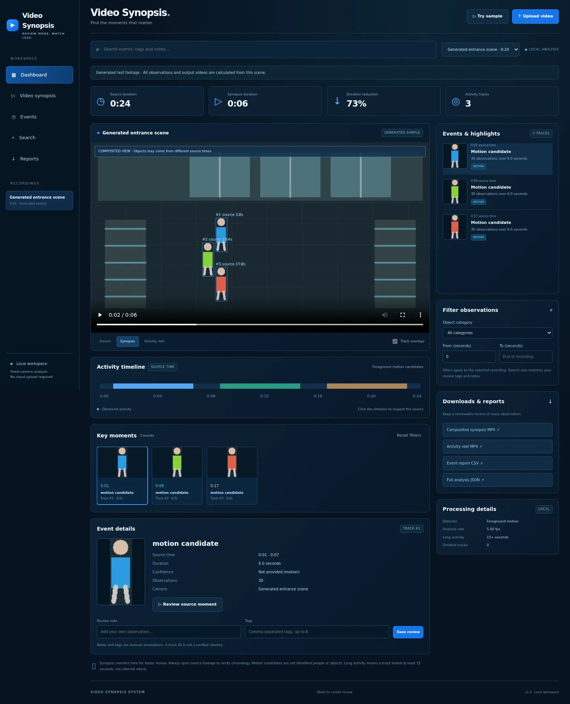

# Video Synopsis System

A working local video-review application inspired by surveillance synopsis dashboards. Upload fixed-camera footage, inspect activity tracks, search event notes and tags, compare source video with a shortened reel and object-composited synopsis, and export review reports.

## Run

Requires Python 3.12 and FFmpeg on your PATH.

```bash
git clone https://github.com/starAIdeveloper/Video-Synopsis-System.git
cd Video-Synopsis-System
python -m venv .venv
# macOS / Linux
source .venv/bin/activate
# Windows PowerShell: .venv\Scripts\Activate.ps1
pip install -r requirements.txt
uvicorn app:app --host 127.0.0.1 --port 8000 --workers 1
```

Open http://127.0.0.1:8000. Choose **Try sample** to generate and process an original entrance scene, or upload your own clip. The sample is explicitly labeled and runs through actual detection, tracking, scheduling, composition and encoding; events and compression statistics are not hard-coded.

## Validation preview



[Mobile dashboard](artifacts/synopsis-mobile.webp) · [Browser check report](artifacts/browser-report.json)

Local validation passed 12 backend tests and the browser checks below. The generated 24-second fixture produced a 6.6-second synopsis with three tracks and a 21-second chronological activity reel. These measurements describe the generated fixture only.

## Outputs

| Playback mode | What it contains | Chronology |
| --- | --- | --- |
| Source | Browser-compatible H.264 copy with synchronized observation boxes | Original order |
| Synopsis | Extracted object crops and motion masks placed over a median background | Reordered; source timestamps appear beside each object |
| Activity reel | Source intervals containing retained tracks, with 0.5-second context padding | Original order; inactive time removed |

Synopsis scheduling tries the earliest output frame where an object's bounding boxes do not intersect boxes already scheduled at the same frame. Each track's internal timing and missing-observation gaps are retained. Spatially separate objects observed at different source times can appear together. The synopsis is a review aid, not evidence that events happened simultaneously. Always open the source moment to verify chronology. A crowded scene can yield little compression or even a longer synopsis.

The activity reel preserves sampled source frames, rather than replacing the source with a sped-up animation. All outputs are silent H.264 MP4s. Analysis runs at up to 5 fps; output frame rate equals the actual analysis sample rate, including non-divisible source rates.

## Dashboard features

- Original, synopsis and activity-reel playback with native video controls.
- Source activity timeline, key-moment thumbnails and track details.
- Search by observed label, track number, manually entered note and tags.
- Category and source-time-range filters for the selected recording.
- Multiple saved recordings with camera labels and optional recording-start metadata.
- Editable review notes and tags, stored persistently.
- MP4 downloads, event CSV report and full JSON analysis export.
- Responsive desktop and mobile layout.

A camera label is metadata supplied at upload, not a connection to a live camera. This project does not implement RTSP ingestion, multi-camera identity matching, authentication, live alerts or public hosting.

## Detection and limitations

Default: OpenCV MOG2 foreground extraction followed by Hungarian track association with velocity prediction, distance gating and expiry. These are **motion candidates**, not recognized people, vehicles or bags. No confidence percentage is fabricated for foreground observations. Track IDs can split or switch when objects overlap or disappear. They are not verified identities.

Long activity means a retained track spans at least 15 seconds. It does not infer loitering, intent, threat, a product interaction, an entry or an exit. Semantic categories become available only through an optional compatible local object detector. Review notes are manual annotations, not model predictions.

Fixed cameras, stable illumination and relatively clear foreground motion are required. Moving cameras, reflections, shadows, crowded scenes and occlusions can degrade extraction. Motion masks and rectangular crops can retain background pixels or leave artifacts. The median background may contain ghosting. Optional detection uses motion masks when available and an opaque rectangular crop when foreground masking is insufficient; it is not instance segmentation. A maximum of 40 sufficiently observed tracks are composited; omitted tracks are counted in the report. Neither real surveillance accuracy nor commercial-system equivalence has been benchmarked.

For memory and processing bounds, clips are limited to five minutes / 200 MB, source rates to 120 fps, decoded frames to 16 MP, analysis resolution to 960×540, and extracted crop memory to 200 MB. Analysis queues up to three jobs and processes one at a time. Large or dense scenes should be split into shorter recordings. Longer-duration archive ingestion would need a separate chunking/storage pipeline.

## Optional semantic model

Default operation needs no model download or GPU. Install `ultralytics` separately and set `SYNOPSIS_MODEL` to an existing local YOLO detection `.pt` model before starting. Supported class names: person, car, truck, bus, motorcycle, bicycle, backpack and handbag. Person, vehicle and bag filters use actual model labels, not assumptions from the generated fixture.

```bash
pip install ultralytics
export SYNOPSIS_MODEL=/absolute/path/to/your-detection-model.pt
```

PowerShell: `$env:SYNOPSIS_MODEL = 'C:\models\detector.pt'`.

The app does not download pretrained weights. Check the model and Ultralytics license for your intended use. The optional adapter requires separate model-inference and real-footage validation; local tests use the default motion detector.

## Storage

`data/{job-id}/` stores source uploads, browser outputs, thumbnails, metadata and JSON results. `data/` and model weights are excluded from Git. Completed recordings and notes survive restarts; unfinished processing must be restarted with a fresh upload. Stop the server and remove unwanted recording directories to reclaim disk space. Keep the service bound to loopback unless you add authentication and access control. Videos stay on the machine hosting this server; GitHub contains code and generated validation screenshots only.

## Tests

```bash
pip install -r requirements-dev.txt
pytest -q
playwright install chromium
# Start the app in another terminal, then:
python scripts/browser_check.py
```

Or set `SYNOPSIS_START_SERVER=1` when running the browser check to start its local server automatically. `SYNOPSIS_CHROMIUM` optionally selects an existing Chromium executable. `SYNOPSIS_URL` overrides the default test URL when using an already running server.

Tests cover scheduling collisions and gaps, tracking association, merged activity windows, real output duration, empty/corrupt scenes, uploads, media-range seeking, annotations, exports and restart persistence. Browser checks cover playback modes, actual shorter synopsis output, source seeking, search/filtering, MP4 and CSV downloads, note persistence, uploaded footage, recording selection, and 1536×1050 / 390×844 viewports. They are generated-fixture and browser-viewport tests, not tests on physical phones or real surveillance deployments.

GitHub Actions runs backend and browser checks on pushes and pull requests. `requirements-lock.txt` records the full development environment; `requirements.txt` pins runtime packages. The optional Ultralytics model is not part of that environment.

## Docker

```bash
docker build -t video-synopsis .
docker run --rm -p 127.0.0.1:8000:8000 video-synopsis
```

Mount storage with appropriate permissions for the `synopsis` user if persistence is needed. Docker setup is supplied but has not been executed in local validation.

## API

Interactive API documentation is at `/docs`.

| Endpoint | Purpose |
| --- | --- |
| `POST /api/upload` | Multipart file, camera label and optional ISO start timestamp |
| `POST /api/sample` | Generate and analyze the test scene |
| `GET /api/recordings` | List completed recordings |
| `GET /api/jobs/{id}` | Processing state and progress |
| `GET /api/jobs/{id}/result` | Tracks, events, schedule and output durations |
| `GET /api/jobs/{id}/media/{name}` | Output video/thumbnail; video supports HTTP Range |
| `POST /api/jobs/{id}/events/{event_id}` | Save review note and tags |
| `GET /api/jobs/{id}/export?format=csv` | Event CSV; omit format for full JSON |

## Implementation history

Built with AI assistance in successive commits: application scaffold, analysis engine, dashboard, automated tests and validation fixes, and review evidence. Imported GitHub commits record their original local SHA. `Video-Synopsis-history.bundle` preserves the original local commit IDs, authors and timestamps.
